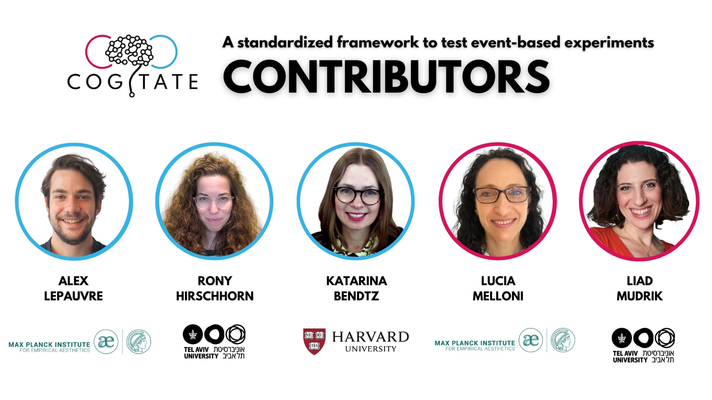

# ExperimentTestingFramework
This repository contain all code used in the paper: "A standardized framework to test event-based experiments."

## Setup
The only dependency of this repository is mne python. Make sure to follow the installation guidelines [here](https://mne.tools/stable/install/index.html)

If you wish to run the simulation of ERP, make sure to download the EEG data set found here:
https://purl.stanford.edu/bq914sc3730 [[1]](#1)

The scripts for the simulation are organized such that each analysis is accompanied by a config.json file.
The variable "bids_root" should be adjusted in each of them with the path to where you wish to store the data. 

## Dummy Experiment
To illustrate how to conduct this framework, we provide a [dummy experiment](https://github.com/Cogitate-consortium/ExperimentTestingFramework/tree/main/dummyExperiment)
 accompanied by a [Jupyter notebook](https://github.com/Cogitate-consortium/ExperimentTestingFramework/blob/main/dummyExperiment/TestingProtocol.ipynb) illustrating how this our testing pipelines can be applied to fully characterize the performances of an experimental setup

## Simulations
To run the simulation and generate the figures presented in the paper, the downloaded data must
first be converted to an MNE compatible format. This is achieved by running the script:
```
00_object_processing_dataset_preparation.py
```
This script contains the function called conversion_manager, to which you should pass the path
to the downloaded data. The script will save the data under...

Once the data are downloaded, you can launch the script to simulate ERPs.

### ERP simulation
To simulate jitter and label shuffle effects in the ERP data, you should execute the scripts:
```
01_simulation_erp.py 
```
Make sure to pass the right config file (as set in the script). This script will fit a gaussian to the P1 component of the 
downloaded data. The fitted parameters of this component will then be used to generate single trial data according to the 
parameters set in the config file. Then, jitter and label shuffle will be applied to the simulated single sweeps. The 
results will be saved under bids_root/derivatives/erp. Note that this script only saves csv files containing the results
and does not perform the plotting.

### RT simulation
To simulate RT data, you should execute the script called 
```
02_simulation_rt.py
```
Again, make sure to pass the right config file. This script will generate reaction time from lognormal distribution and simulate difference in RT to two arbitrary
condition to match specified effect sizes. Then, jitter and label shuffle will be applied to the single trial reaction time
and the results will be stored under bids_root/derivatives/rt. 

### Plotting
Once both analysis have been executed, the plotting can be executed by launching the script 
```
03_plot_simulation.py
```
This script will plot the results of the ERP and RT simulations and save them alongside the data (in bids_root/derivatives/erp 
and bids_root/derivatives/rt) respectively. 

## Survey results
The survey results can be found under: ExperimentTestingFramework\surveyAnalysis\results-survey.csv. The script
```
process_survey.py 
```
performs preprocessing (such as removing incomplete responses) and outputs the processed dataset (processed_dataset.csv) which contains the data of all the participants who completed the survey (N=100). 
Then, based on this dataframe, it generates all the plots found in both the paper and supplementary, each accompanied by its specific dataframe (csv file). 

## References
<a id="1">[1]</a> 
Kaneshiro, B., Perreau Guimaraes, M., Kim, H. S., Norcia, A. M., & Suppes, P. (2015). 
A representational similarity analysis of the dynamics of object processing using single-trial EEG classification. 
Plos one, 10(8), e0135697.

# Acknowledgments
This repository is brought to you by the following members of the cogitate consortium:
<div style="display: flex; flex-wrap: wrap; justify-content: space-around;">
   <div style="text-align: center;">
      <a href="https://www.arc-cogitate.com/our-team" target="_blank">
         
      </a>
   </div>
</div>
<br />
We would like to thank all the COGITATE consortium members:
<div style="display: flex; flex-wrap: wrap; justify-content: space-around;">
   <div style="text-align: center;">
      <a href="https://www.arc-cogitate.com/our-team" target="_blank">
         
      </a>
   </div>
</div>

<br />
<br />

This research was supported by Templeton World Charity Foundation ([TWCF0389](https://doi.org/10.54224/20389)) and the Max Planck Society. The opinions expressed in this publication are those of the authors and do not necessarily reflect the views of TWCF.